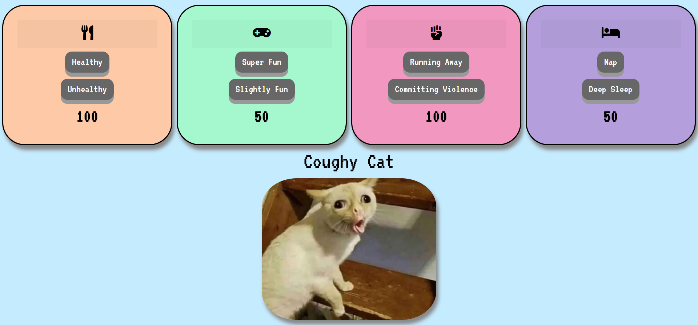

# Tamagotchi
This was built as an exercise to build a single page tamagotchi. The user can let the tamagotchi pet eat, play, fight, or sleep and the health will adjust.

## Motivation
This challenge was given to us to test our knowledge and skills with modularizing our JS and SASS files. Also a webpack was recently introduced to us so we had to use a webpack template to complete this project.

## Screenshots

## Build Status

## Build Link
[Coughy Cat Tamagotchi](https://coughycat.netlify.app/)

## Tech Used
* JavaScript ES6
* JQuery
* SASS
